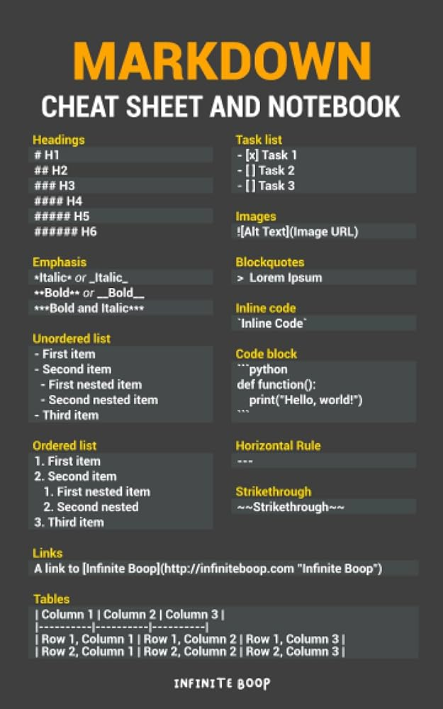

# Címsor 1
## Címsor 2
### Címsor 3
#### Címsor 4
#### Címsor 5
##### Címsor 6

# Bekezdés sortörésekkel

Ez egy itt egy paragrafus.

Ez pedig a következő bekezdés.

# Felsorolás

- foo
- bar

* egg
* ham

# Számozás

1. first
1. second

# Tennivalók

- [ ] Todo1
- [ ] Todo2
- [X] Done

# Választóvonal

---

# Idézet vagy kiemelés

> idézet

# Inline formázás

lorem ispum dolor **erős kiemelés** gloria mundi *finom hangsúlyozás* lorem ~~kihúzni szöveget~~ lorem

# Linkek

[link szöveg](https://umszki.hu/)

# Képek




# Táblázat

| Középre igazított | Jobbra zárt |
| :---------------: | ----------: |
| Érték 1           | Érték 2     |
| Érték 1           | Érték 2     |
| Érték 1           | Érték 2     |

# Kódrészlet

Backtick karakter AltGr + 7

```
<h1>Címsor</h1>
```

```html
<p>Ez egy html kód</p>
```

```css
body { color: red; }
```

```js
console.log()
```

```python
print()
```


