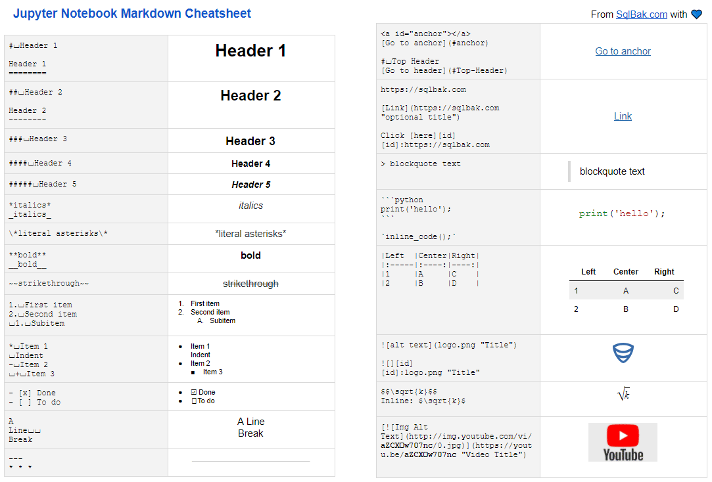

# EZ ITT VILÁG LEGFONTOSABB CÍMSORA (TILOS MÓDOSÍTANI!)
# Trolololo
## Címsor 2
### Címsor 3
#### Címsor 4
##### Címsor 5
###### Címsor 6

# Markdown

## Blokkok

### Felsorolás

- egg
- ham
- spam

### Számozás

1. foo
1. bar
1. baz

### Bekezdés

Egy paragus, vagyis egyetlen összetartozó gondolat, amit folyó szövegként írunk le, a végén enterrel zárjuk.

Itt nem kell < p > címkével nyitni és a végén </ p > taggel zárni, hanem elég két darab sortöréssel jelölni.
Ez például csak egy sortörés volt, nem lesz belőle új bekezdés.

### Blokkols idézet (szövegdoboz)

    Ez egy kimelt rész

    Gyakran hosszab idézethez

Egész eddig.

### Vízszintes választóvonla

---


```
Backtick kakakter AltGr + 7
```

``` html
<h1>Kódrészlet</h1>
```

``` css
p { color: red; }
```

```python
print("szöveg")
```

### Táblázat

Pipe karakter AltGr + W

 Fejléc | Fejléc 
 ------ | ------ 
 Adatok | Adatok 
 KövSor | KövSor 
  ....  |  ...   
  stb.  | stb.   

## Szövegformázások (inline)

*dőlt*

**félkövér**

_dőlt_

__félkövér__

~~AltGr+1~~

## Linkek

http://umszki.hu/

Szögletes zárójel AltGr + F

[link szövege](http://umszki.hu/)

[cheat sheet itt](https://external-preview.redd.it/uRpAK3DjSQ2U_XCq3_WsE1RIs8FLpoekJBw3U5t2hTU.jpg?auto=webp&s=b801ecbc86b4ae4d4e5ca27439865f960a55a214)

### Kép beszúrása




